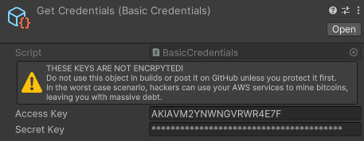

# Credentials

In order to access your S3 bucket, you need to provide some form of credentials. `Cubusky S3` provides its own implementation in the form of `Basic Credentials`, but you may easily provide your own implementation through the `ICredentials` interface.

## Getting basic credentials from S3

1. Go to your AWS Console.
2. Select "Identity and Access Management (IAM)."
3. Create a custom policy. Less permissions on your policy means less access to hackers in case you get hacked.
    1. Select "Policies" from "Access Management."
    2. Select "Create policy."
    3. Choose the "S3" service and specify your actions. The permissions that `Cubusky S3` needs can be found in the [IAM Permissions](./Permissions.md).
    4. Fill out any other details and name your policy.
4. Select "Users" from "Access Management."
5. Select an existing user or create a new user.
6. Select the "Permissions" tab and attach your custom policy.
7. Select the "Security Credentials" tab and click on "Create access key" to generate a new access and secret key pair.

You now have an access- and secret key as inputs for your credentials.