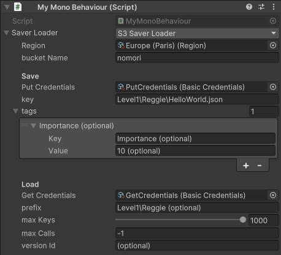
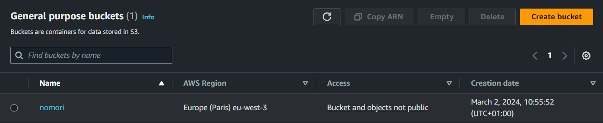
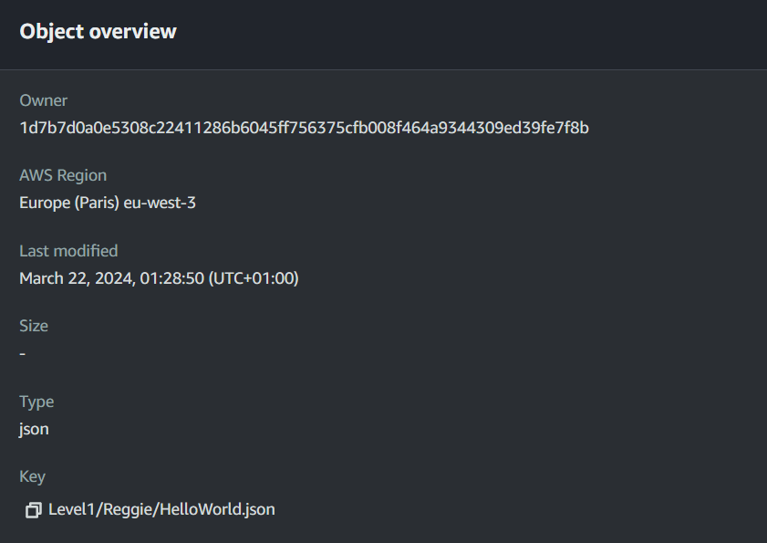
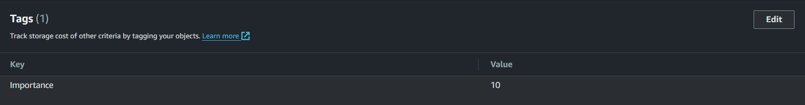
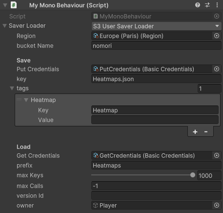

# S3 Saver Loader

S3SaverLoader saves and loads data to and from an S3 bucket.



## General Settings

- The region is where your bucket is located (AWS Region).
- The bucket name is the name of your bucket (Name).



- The key determines the file path to save to.
- The tags list allows you to provide additional tags when saving an object to S3.




- The prefix is used to only load objects from a relative path.
- The max keys is used to limit the amount of objects that can be loaded in a single batch. Typically you want this to be as high as possible, since Amazon will always charge the same price no matter how many objects you collect in a single batch.
- The max calls is used to limit the amount of calls to make to Amazon servers when loading huge amounts of objects (indefinite when set to -1). If your server contains millions of objects, collecting all objects can be costly. When you only need to collect 10,000 objects, you can instead set your max keys to 1,000 and your max calls to 10. Same results for a fraction of the costs.

## Extensibility

It may be important to determine your save key based on runtime data. The easiest way by far to do so is to extend the `S3SaverLoader` (or any `ISaverLoader` for that matter). As long as it's serializable, you may then select it like any other `ISaverLoader` in the inspector.

```csharp
[Serializable]
public class S3UserSaverLoader : S3SaverLoader, IS3Saver, IS3Loader
{
    [field: SerializeField] public GameObject owner { get; set; }

    new public string key
    {
        get
        {
            var userId = GetUserId(); // pseudo code

            var fullPath = Path.ChangeExtension(base.key, null).Replace('\\', '/');
            var extension = Path.GetExtension(base.key);

            return !owner.scene.IsValid()
                ? throw new InvalidOperationException($"Can't save or load when an owner has an invalid scene reference")
                : $"{fullPath}/{owner.scene.name}/{userId}/{DateTime.UtcNow:u}{extension}"
                .TrimStart('/');
        }
    }
}
```



Given a scene named `level 1` and a user id of `1234`, these settings will result in the following path in your S3 bucket: `Heatmaps/level 1/1234/2024-03-21 20:07:52Z.json`